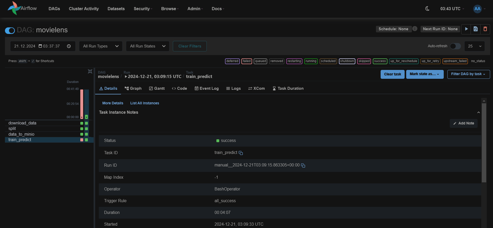
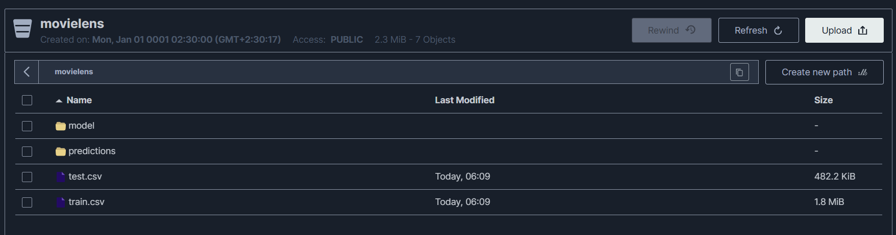
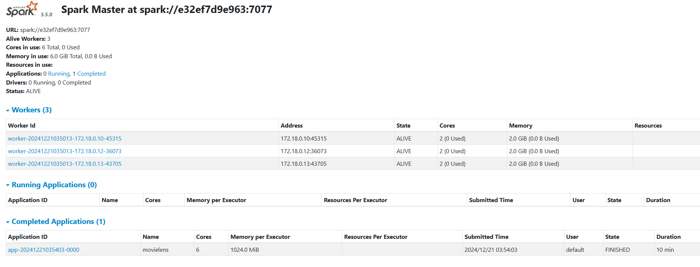
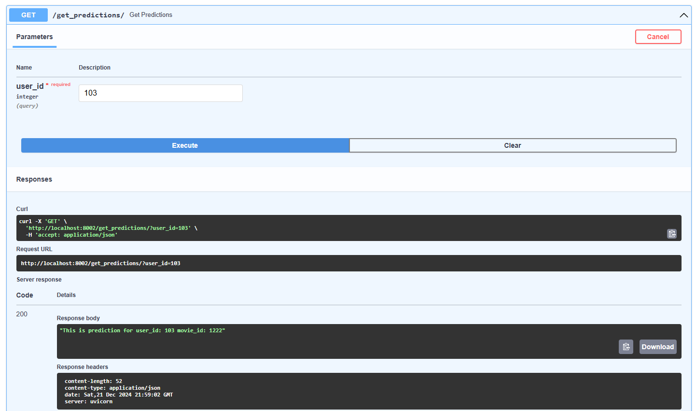
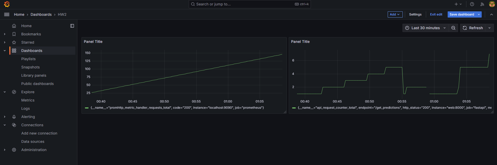

# MovieLens Pipeline with Apache Airflow, MinIO, Apache Spark, FastAPI, Prometheus and Grafana

### Steps to Run
Add to .env

```AIRFLOW_UID=1234321
MINIO_ACCESS_KEY="minioaccesskey"
MINIO_SECRET_KEY="miniosecretkey"
BUCKET_NAME="movielens"
```


   ```bash
   docker-compose up -d --build
   ```
   ```bash
   docker compose up airflow-init  
   ```

### Airflow
http://localhost:8080

### Minio
http://localhost:9091

### Spark
http://localhost:9080

### FastAPI
http://localhost:8002/docs#

### Grafana
http://localhost:3000/

You can also use json to import a dashboard

[Grafana Dashboard json](grafana_data%2FHW2-1734819128603.json)